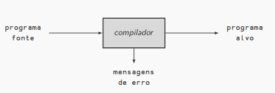
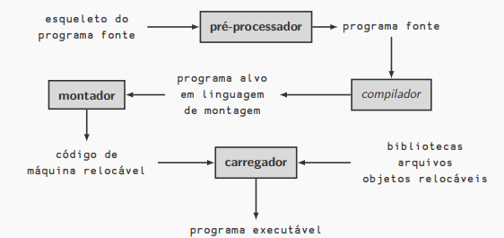
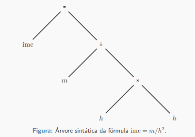
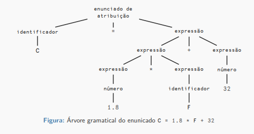
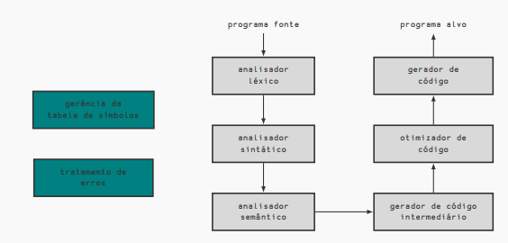
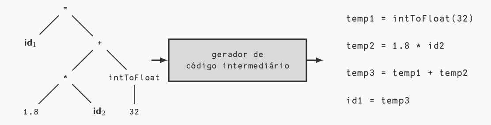
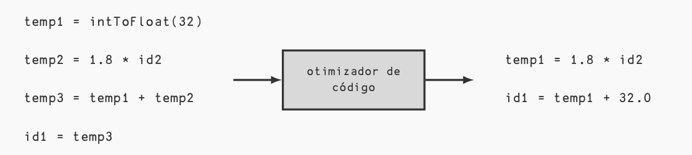
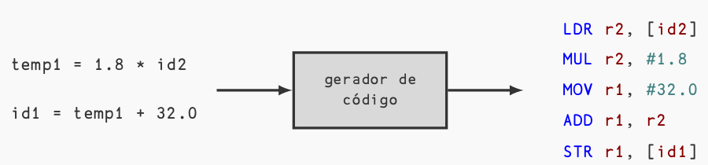
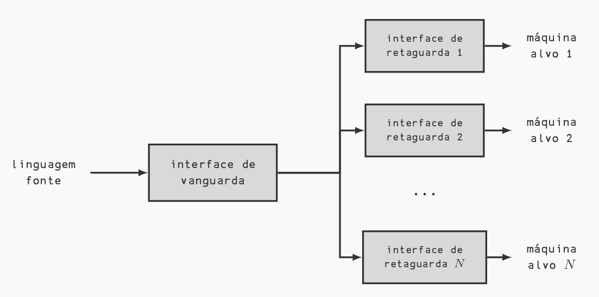
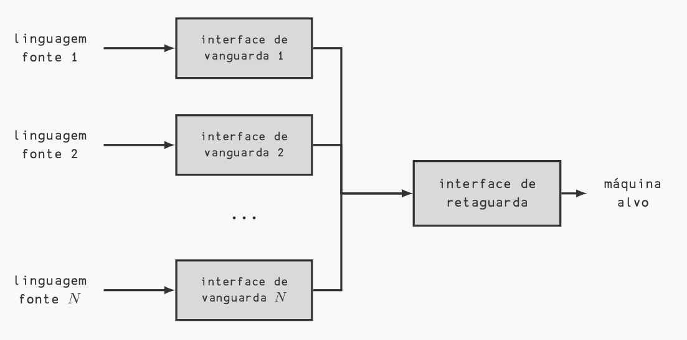

# Aula 1 - Introdução à Compilação

## Introdução

Os primeiros compiladores surgiram, junto com as primeiras linguagens de programação, na década de 50. Eles lidavam, inicialmente, com a tradução de fórmulas aritméticas (FORTRAN - Formula Translator).

Os compiladores eram considerados programas difíceis de se escrever, o primeiro compilador Fortran levou 18 homens-ano para ser escrito.

> 1 homem-ano equivale a aproximadamente 2.080 horas.

Embora a tarefa de escrever de compiladores ainda não seja uma tarefa trivial, os avanços da área facilitaram a redução do tempo de escrita.

## Compiladores

> Definição de compilador (informal)
>
> Um compilador é um programa que lê um programa escrito em uma linguagem (linguagem fonte) e o traduz para outra linguagem (linguagem alvo).

### Características dos compiladores

- O processo de compilação deve identificar e relatar possíveis erros no programa fonte.
- Em geral, as linguagens fonte são linguagens de programação tradicionais.
- As linguagens alvo podem ser tanto linguagens tradicionais quanto de máquina.
- Podem ser classificados de diversas formas, dependendo de seu objetivo ou como foi construído (de uma passagem, múltiplas passagens, depuradores e etc).
- Além do compilador, outros programas podem ser usados na criação do programa executável.
- Antes de ser passado para o compilador, o programa fonte pode ser pré-processado.

Exemplo: O pré processador da linguagem C processa as diretivas, como #include e #define.

- Após a compilação, o programa alvo pode demandar processamento adicional para a construção do executável.

Exemplo: Para a linguagem C, temos o montador e o linkeditor.

## Análise e síntese

- A compilação é composta por duas partes: análise e síntese.
- A análise divide o programa fonte em partes constituintes e as organiza em uma representação intermediária.
- Em geral, a representação intermediária consiste consiste em uma árvore sintática, onde cada nó representa uma operação e cada filho representa um operando.
- A síntese constrói o programa alvo a partir desta representação intermediária.

### Análise do programa fonte

A análise é composta por três fases:

1. Análise léxica (linear): o fluxo de caracteres que compõem o programa alvo é lido, da esquerda para direita, e agrupado em tokens.

2. Análise sintática (hierárquica): os tokens são ordenados hierarquicamente em coleções aninhadas com significado coletivo.

3. Análise semântica: verificação que garante que os componentes do programa se combinam de forma significativa.

**_Tokens são sequências de caracteres com significado coletivo._**

## Análise léxica

Considere o enunciado:

`C = 1.8 * F + 32`

Os seguintes 7 tokens podem ser identificados durante a análise léxica:

- O identificador C
- O símbolo de atribuição =
- A constante em ponto flutuante 1.8
- O símbolo de multiplicação \*
- O identificador F
- O símbolo de adição +
- A constante inteira 32

> Observação: a análise léxica não conta o espaçamento.
>
> Exemplo de identificação de erro léxico em C:
>
> `x = 089;`
>
> Já que o dígito 0 precedendo uma constante indica que o número está na base octal e 8 e 9 não são dígitos da base octal.

## Análise sintática

Essa análise agrupa os tokens hierarquicamente, em geral em uma árvore gramatical. A estrutura hierárquica pode ser definida por meio de regras recursivas.

Por exemplo, considere as seguintes regras:

1. Qualquer identificador é uma expressão.
2. Qualquer número é uma expressão.
3. Se $ E_1 $ e $ E_2 $ são expressões, também são expressões $ E_1+E_2 $ e $ E1*E2 $.
4. Se $I$ é um identificador e $E$ uma expressão, então $I = E$ é um enunciado.

> ### Travessia de árvores
>
> 1. Por largura:
>
> - UDLR
> - UDRL
> - DULR
> - DURL
>
> U: up, D: down, R: right, L: left.
>
> 2. Por profundidade:
>
> - VLR: pré-ordem
> - LVR: in-ordem
> - LRV: pós-ordem
> - VRL
> - RVL
> - RLV
>
> V: visitar o nó, L: left e R: right

## Análise semântica

Verifica potenciais erros semânticos no programa fonte. Ela usa a árvore da análise sintática para identificar operadores e operandos das expressões e enunciados e também faz a verificação de tipos.

Caso os tipos dos operandos não sejam compatíveis com os tipos esperados pelos operadores, esta análise retorna um erro ou faz uma promoção (ou conversão) de tipos, a depender da linguagem alvo.

> Por exemplo, na expressão `C = 1.8 * F + 32` o valore `32` deve ser promovido para ponto flutuante ou deve ser sinalizado um erro de tipo.

## As fases de um compilador

- Conceitualmente, o compilador opera em fases.
- Cada fase manipula o programa fonte e entrega o resultado para a próxima fase.
- As primeiras fases estão relacionadas à análise do programa fonte e as últimas, à síntese (construção do programa alvo).

> Duas atividades perpassam todas as fases: gerência da tabela de símbolos e o tratamento de erros.

## Gerenciamento da tabela de símbolos

- Uma tabela de símbolos é uma estrutura de dados contendo um registro para cada identificador, com os campos contendo seus atributos. Quando o analisador léxico detecta um identificador, este instala-o na tabela de símbolos.

- Os atributos de um identificador normalmente são determinados após a análise léxica, mas sim durante as fases remanescentes de compilação.

- Exemplos de possíveis atributos de um identificador: nome, tipo, memória e escopo.

- Caso o identificador se refira a um procedimento, dentre seus atributos devem constar a quantidade de seus parâmetros e respectivos tipos, modo de passagem (cópia ou referência) e o tipo de retorno, se houver.

## Tratamento de erros

- Os erros podem ocorrer em qualquer fase da compilação.

- Após a identificação do erro, o compilador deve tratá-lo de alguma maneira e, se possível, continuar o processo em busca de outros erros.

- Abortar a compilação logo no primeiro erro pode diminuir a utilidade do compilador.

- As análises sintática e semântica podem identificar uma parcela considerável dos erros no programa fonte.

> Exemplo: o prosseguimento da compilação após um erro léxico pode ajudar na geração de uma sugestão de correção para o erro.

## Geração de código intermediário

A utilização do código intermediário visa aumentar o reaproveitamento do compilador para outras linguagens.

> Teorema da Programação Estruturada: É possível escrever qualquer programa se a "linguagem" permite
>
> - Sequenciamento
> - Seleção
> - Repetição

A árvore resultante da análise semântica é transformada pelo compilador em um código intermediário. Esta representação pode ser entendida como um código para uma máquina abstrata, que deve computar expressões, tratar dos fluxos de controle e das chamadas de procedimentos.

O código intermediário deve ter duas qualidade fundamentais:

   1. Deve ser fácil de gerar.
   2. Deve ser fácil de traduzir para o programa alvo.

> Uma representação possível é o código de três endereços.

## Otimização do código

Tem como principal objetivo melhorar a performance (tempo de execução e uso de memória) do código de máquina do programa alvo, a partir do código intermediário. Algumas otimizações são triviais, enquanto outras demandam algoritmos sofisticados que podem impactar o tempo de compilação.

As alterações não devem alterar a semântica do código intermediário.

## Geração de código

Etapa final da compilação, na qual é feita a produção do código alvo, geralmente em linguagem de máquina relocável ou código de montagem. Nesta etapa são atribuídas as localizações de memória para as variáveis e também é feita a atribuição das variáveis aos registradores.

## Interface de vanguarda (front-end) e retaguarda (back-end)

Na prática, as fases de compilação são agrupadas em duas interfaces: vanguarda e retaguarda.

- A interface de vanguarda contém as etapas que dependem primariamente do programa fonte e independem da máquina alvo. Em geral, ela inclui
  - as fases de análise, criação da tabela de símbolos e a geração de código intermediário.
  - os tratamentos de erros e as manipulações necessárias na tabela de símbolos, associados a estas fases.
  - algum nível de otimização.

- A interface de retaguarda contém as fases que dependem primariamente da máquina alvo e independem do programa fonte. O ponto de partida é o código intermediário e, em geral, ela inclui
  - as fases de otimização e geração do código.
  - os tratamentos de erros e as manipulações necessárias na tabela de símbolos, associados a estas fases.

Em um cenário ideal, ambas interfaces são independentes, o que permite fixar uma delas e alterar a outra para obter diferentes compiladores com diferentes objetivos.

## Ferramentas para a construção de compiladores

- Ferramentas úteis no desenvolvimento de software: editor de texto, depuradores, gerenciadores de versão e etc.
- Geradores de analisadores gramaticais produzem analisadores sintáticos a partir de uma entrada baseada em uma gramática livre de contexto (Yacc, Bison, etc).

- Geradores de analisadores léxicos geram os mesmos a partir de especificações baseadas em expressões regulares (Lex, Flex, etc).

- Dispositivos de tradução dirigida pela sintaxe produzem uma coleção de rotinas que percorrem uma árvore gramatical, gerando um código intermediário a partir dela.

- Geradores automáticos de código estipulam regras que traduzem cada operação da linguagem intermediária para a linguagem de máquina alvo.

- Dispositivos de fluxo de dados atuam na fase de otimização a partir da observação do fluxo de dados entre as diferentes partes de um programa.
