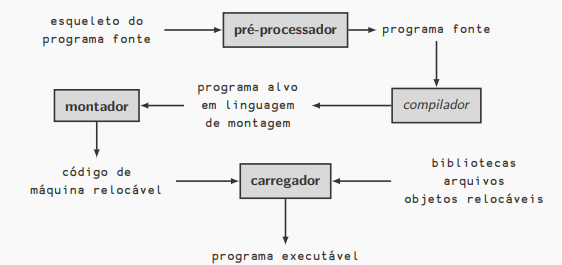
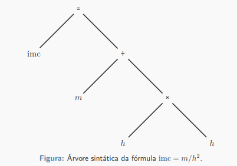
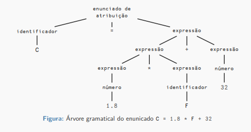
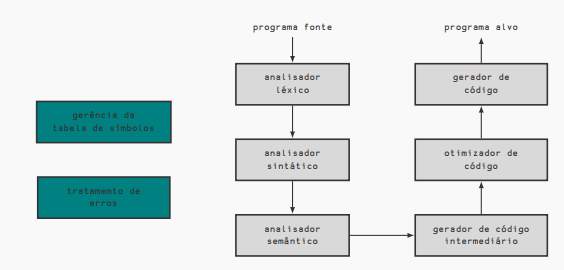

# Aula 1 - Introdução à Compilação

## Introdução

Os primeiros compiladores surgiram, junto com as primeiras linguagens de programação, na década de 50. Eles lidavam, inicialmente, com a tradução de fórmulas aritméticas (FORTRAN - Formula Translator).

Os compiladores eram considerados programas difíceis de se escrever, o primeiro compilador Fortran levou 18 homens-ano para ser escrito.

> 1 homem-ano equivale a aproximadamente 2.080 horas.

Embora a tarefa de escrever de compiladores ainda não seja uma tarefa trivial, os avanços da área facilitaram a redução do tempo de escrita.

## Compiladores

> Definição de compilador (informal)
>
> Um compilador é um programa que lê um programa escrito em uma linguagem (linguagem fonte) e o traduz para outra linguagem (linguagem alvo).

- O processo de compilação deve identificar e relatar possíveis erros no programa fonte.
- Em geral, as linguagens fonte são linguagens de programação tradicionais.
- As linguagens alvo podem ser tanto linguagens tradicionais quanto de máquina.
- Além do compilador, outros programas podem ser usados na criação do programa executável.
- Antes de ser passado para o compilador, o programa fonte pode ser pré-processado.

Exemplo: O pré processador da linguagem C processa as diretivas, como #include e #define.

- Após a compilação, o programa alvo pode demandar processamento adicional para a construção do executável.

Exemplo: Para a linguagem C, temos o montador e o linkeditor.

## Análise e síntese

- A compilação é composta por duas partes: análise e síntese
- A análise divide o programa fonte em partes constituintes e as organiza em uma representação intermediária
- Em geral, a representação intermediária consiste consiste em uma árve sintática, onde cada nó representa uma operação e cada filho representa um operando
- A síntese constrói o programa alvo a partir desta representação intermediária

### Análise do programa fonte

A análise é composta por três fases:

1. Análise léxica: o fluxo de caracteres que compõem o programa alvo é lido, da esquerda para direita, e agrupado em tokens
2. Análise sintática: os tokens são ordenados hierarquicamente em coleções aninhadas com significado coletivo
3. Análise semântica: verificação que garante que os componentes do programa se combinam de forma significativa

#### Análise léxica

`C = 1.8 * F + 32`

Os seguintes 7 tokens podem ser identificados:

- O identificador C
- O símbolo de atribuição =
- A constante em ponto flutuante 1.8
- O símbolo de multiplicação \*
- O identificador F
- O símbolo de adição +
- A constante inteira 32

> Observação: a análise léxica não conta o espaçamento.

> Exemplo de identificação de erro léxico em C:
>
> `x = 089;`
>
> Já que o dígito 0 precedendo uma constante indica que o número está na base octal, e 8 e 9 não são dígitos da base octal.

#### Análise sintática

Essa análise agrupa os tokens hierarquicamente por meio de regras recursivas. Considere as seguintes regras:

1. Qualquer identificador é uma expressão
2. Qualquer número é uma expressão
3. Se E_1 e E_2 são expressões, também são expressões E_1+E_2 e E1\*E2
4. Se I é um identificador e E uma expressão, então I = E é um enunciado.

Travessia de árvores:

1. Por largura:
   - UDLR
   - UDRL
   - DULR
   - DURL

> U: up
> D: down
> R: right
> L: left

2. Por profundidade:
   - VLR: pré-ordem
   - LVR: in-ordem
   - LRV: pós-ordem
   - VRL
   - RVL
   - RLV

> V: visitar o nó
> L: left
> R: right

#### Análise semântica

Verifica potenciais erros semânticos no programa fonte. Ela usa a árvore da análise sintática para identificar operadores e operandos das expressões e enunciados e também faz a verificação de tipos.

Exemplo:
`C = 1.8 * F + 32`

A expressão à direita inclui dois tipos de números, o valor 32 antes deve ser promovido para ponto flutuante ou deve ser sinalizado um erro de tipo.

### As fases de um compilador

- Conceitualmente, o compilador opera em fases.
- Cada fase manipula o programa fonte e entrega o resultado para a próxima fase.
- As primeiras fases estão relacionadas à análise do programa fonte, as últimas estão relacionadas à síntese (construção do programa alvo).

> Duas atividades perpassam todas as fases: gerência da tabela de símbolos e o tratamento de erros.

