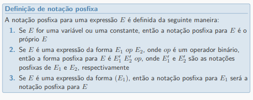

# Aula 2 - Um compilador simples de uma passagem

## Visão geral

Uma linguagem de programação pode ser caracterizada por sua sintaxe (aparência e forma de seus elementos) e por sua semântica (o significado destes elementos). Uma forma de especificar a sintaxe de uma linguagem é a **gramática livre de contexto** (BNF - Forma de Backus-Naur).

Além de especificar a semântica, a gramática libre de contexto auxilia a tradução do programa, por meio da técnica denominada tradução dirigida pela sintaxe.

## Definição da sintaxe

A gramática livre de contexto (gramática, de forma simplificada) especifica a sintaxe da linguagem. Ela descreve a estrutura hierárquica de muitas construções das linguagens de programação.

### Exemplo

Observe o comando if-else na linguagem C.

```C
    if (expressão) comando else comando
```

O comando é a concatenação dos seguintes elementos: palavra-chave **if**, um **parênteses a esquerda**, uma *expressão*, um **parênteses a direita**, um *comando*, a palavra-chave **else** e outro *comando*.

Essa regra de estruturação pode ser expressa pela **produção** abaixo.

$$ cmd \rightarrow \textbf{if} \left ( \mathit{expr} \right ) \mathit{cmd}\ \textbf{else}\ \mathit{cmd}$$

Em uma produção, os elementos léxicos, como a palavra-chave **if** e os parênteses, são chamados de *tokens* ou *terminais*. As variáveis como *expr* e *cmd* representam sequências de *tokens* e são chamadas de *não-terminais*.

> Componentes da gramática livre de contexto
>
> 1. Um conjunto de tokens, denominados símbolos **terminais**.
> 2. Um conjunto de *não-terminais*.
> 3. Um conjunto de produções. Cada produção é definida por um não-terminal (lado esquerdo), seguido de uma seta, sucedida por uma sequência de tokens e/ou não-terminais (lado direito).
> 4. Designação de um dos não-terminais como símbolo de partida.

- Convenções:
  - A gramática é especificada por uma lista de produções.
  - O símbolo de partida é definido como o não-terminal da primeira produção listada.
  - Dígitos, símbolos e palavras em negrito são terminais.
  - Não-terminais grafados em itálico.
  - Os demais símbolos são tokens.
  - O caractere "|" denota "ou", neste contexto.

Exemplo:
>
> $ \mathit{expr} \rightarrow \mathit{expr} + \mathit{digito} | \mathit{expr} - \mathit{digito} | \mathit{digito} $
>
> $ \mathit{digito} \rightarrow \mathbb{0} | \mathbb{1} | \mathbb{2} | \mathbb{3} | \mathbb{4} | \mathbb{5} | \mathbb{6} | \mathbb{7} | \mathbb{8} | \mathbb{9}$

- *Expr* e *digito* são não terminais.
- Os **tokens** são: +, -, 0, 1, 2, 3, 4, 5, 6, 7, 8 e 9.
- O símbolo de partida é o não-terminal *expr*..

## Cadeias de tokens

- Uma cadeia de tokens é formada por zero ou mais tokens.
- Uma cadeia contendo zero tokens é dita cadeia vazia e denotada por $\epsilon$.
- Um conjunto de todas as cadeias de tokens possíveis gerados desa maneira formam a **linguagem** definida pela gramática.

> Acerca do exemplo anterior:

Essa gramática pode gerar as expressões: 1+2, 1-2+3-4+5, 7, porém não pode gerar a expressão -2+3, pois na gramática o operador está infixado entre a expressão e um dígito.

Notação:

- Usamos $G$ para denotar a gramática e $L(G) = \{expr | G\ gera\ expr\}$ é a linguagem gerada por G.

Exemplo de construção da expressão 1-2+3 por meio da gramática:

Análise bottom-up:

1. 1 é *expr*, pois 1 é *digito*.
2. 1-2 é *expr*, pois 1 é *expr* e 2 é *digito*.
3. 1-2+3 é *expr*, pois 1-2 é *expr* e 3 é *digito*.

Análise top-down:

1. 1-2 é *expr* e 3 é *digito* 3 (token).
2. 1 é *expr* e 2 é *digito* 2 (token).
3. 1 é *digito* 1 (token).

## Árvore gramatical

Uma árvore gramatical mostra como o símbolo de partida de uma gramática deriva uma cadeia de linguagem.

Exemplo de árvore gramatical para a produção $ A \rightarrow XYZ $


### Propriedades

1. A raiz é rotulada pelo símbolo de partida.
2. Cada folha é rotulada por um token ou pelo $\epsilon$.
3. Cada nó interior é rotulado por um não-terminal.
4. Se A é um não-terminal que rotula um nó interior e $X_1, X_2, ..., X_N$ são os rótulos de seus filhos (da esquerda para a direita), então.
$ A \rightarrow X_1 X_2 ... X_N $ é uma produção.


- A leitura da árvore em ordem (travessia LVR, VLR ou LRV) gera a expressão original, dito *produto* da árvore.
- A análise sintática é o processo de encontrar a árvore gramatical para uma dada cadeia de tokens.
- Uma gramática que permite a construção de duas árvores gramaticais distintas para uma mesma cadeia de tokens é denominada gramática ambígua.

Exemplo de gramática ambígua:

>
> $ \mathit{expr} \rightarrow \mathit{expr} + \mathit{digito} | \mathit{expr} - \mathit{digito} | \mathit{digito} \mathbb{0} | \mathbb{1} | \mathbb{2} | \mathbb{3} | \mathbb{4} | \mathbb{5} | \mathbb{6} | \mathbb{7} | \mathbb{8} | \mathbb{9}$
>


## Associatividade de operadores

Quando um operando está, simultaneamente, à esquerda e à direita de dois operadores (ex: o dígito 2 em 1-2+3) é necessário utilizar convenções para decidir qual operação recebe qual operando.

- Uma operação $\times$ é associativa à esquerda se: $a\times b\times c = \left ( a\times b \right ) \times c$
- Uma operação $\times$ é associativa à direita se: $a\times b\times c =  a\times \left ( b  \times c \right )$

No exemplo abaixo temos um exemplo de operação associativa à direita em c, a atribuição:

```c
int a, b, c; 
a = b = c = 0;
```
<!-- @TODO: incorporar esse pedaço no texto -->

<!-- A gramática possível para essa associação seria:
*expr* -> *var* = *expr* | *var*
*var* -> *var*||*letra* | *letra*
*letra* -> **a** | **b** | ... | **z**

***Obs: || denota a concatenação.*** -->

Cadeias como `a=b=c` com um operador associativo à direita são geradas pela seguinte gramática:

$ direita \rightarrow letra = direita | letra $

$ letra \rightarrow a | b | ... | \ $

Observe na imagem abaixo o contraste entre uma árvore gramatical para um operador associativo à esquerda (como -) e para um associativo à direita (como =).


## Precedência de operadores

- A associatividade não resolve todos os problemas de ambiguidade.
- Dizemos que o operador $\times$ tem maior precedência do que o operador $+$ já que captura os operandos antes que $+$ o faça.
- Se os dois operadores têm a mesma precedência, a associatividade determina a ordem na qual as operações são realizadas.

> ### Exemplo
>
> Como construir uma gramática que satisfaça as condições abaixo?
>
> a) Dois operadores: ? e !
>
> b) Variáveis: a | b | ... | z
>
> c) ? tem maior precedência
>
> d) Ambos associativos à esquerda
>

Para construir uma gramática para expressões com operadores tendo diferentes precedências, devemos seguir um passo a passo:

1. Construir uma tabela com a associatividade e precedência de cada operador, em ordem crescente de precedência.

|||
| --- | --- |
| Associatividade à esquerda | ! | -> _expr_
| Associatividade à esquerda | ? | -> _termo_

2. Para cada nível de precedência cria-se um não terminal, além de um não-terminal extra para gerar as unidades básicas das expressões e expressões dentro de parênteses.

$ \mathit{var} -> \mathbb{a} | ... | \mathbb{z} | \left (\mathit{expr} \right) $

> Os parênteses permitem escrever expressões com níveis arbitrários de aninhamento, sendo que os parênteses tem precedência sobre todos os operadores definidos.

3. Defina das produções para o último terminal criado para os níveis a partir dos operadores com maior precedência

*termo* -> *termo* ? *var* | *var*

Operação associativa à esquerda, já que temos: termo ? var
Associativa à direita seria: var ? termo

4. Faça o mesmo para os demais operadores, em ordem decrescente de precedência e crescente na lista de terminais criados para os níveis

*expr* -> *expr* ! *termo* | *termo*



3 -> Não é necessário parênteses na forma pós fixada.

## Definições dirigidas pela sintaxe

- Usa gramática livre de contexto para especificar estrutura sintática da entrada.
- Associa a cada símbolo da gramática, um conjunto de atributos, e, a cada produção, um conjunto de regras semânticas para computar os valores dos atributos associados aos símbolos presentes na produção.
<!-- @TODO: completar -->

## Esquema de tradução

<!-- @TODO: -->

## Análise gramatical

<!-- @TODO: -->