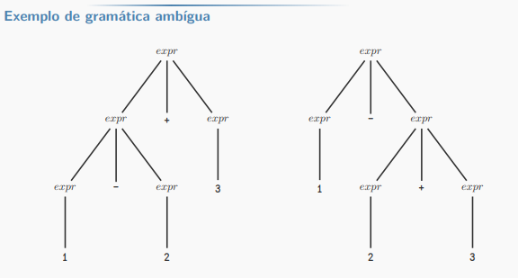

# Aula 3

## Componentes da linguagem livre de contexto

1. Um conjunto de tokens, denominados símbolos terminais.
2. Um conjunto de não-terminais.
3. Um conjunto de produções. Cada produção é definida por um não-terminal (lado esquerdo), seguido de uma seta, sucedida por uma sequência de tokens e/ou não-terminais (lado direito).
4. Designação de um dos não-terminais como símbolo de partida.

- Convenções: 
    - A gramática é especificada por uma lista de produções.
    - O símbolo de partida é definido como o não-terminal da primeira produção listada. 
    - Dígitos, símbolos e palavras em negrito são terminais. 
    - Não-terminais grafados em itálico. 
    - Os demais símbolos são tokens. 
    - O caractere "|" denota "ou", neste contexto. 
<!-- @TODO -->

Exemplo: 
_expr_ -> _expr_ + _digito_ | _expr_ - _digito_ | _digito_
_digito_ -> **0** | **1** | **2** | **3** | **4** | **5** | **6** | **8** | **9**

- expr e digito são não terminais.
- tokens: +, -, 0, 1, 2, 3, 4, 5, 6, 7, 8 e 9.
- o símbolo de partida é o não-terminal _expr_

## Cadeias de tokens

- Uma cadeia de tokens é formada por zero ou mais tokens
- Uma cadeia contendo zero tokens é dita cadeia vazia e denotada por \epislon <!-- @TODO: -->
- Um conjunto de todas as cadeias de tokens possíveis gerados desa maneira formam a linguagem definida pela gramática 

> Acerca do exemplo anterior:

Essa gramática pode gerar as expressões: 1+2, 1-2+3-4+5, 7, porém não pode gerar a expressão -2+3, pois na gramática o operador está infixado entre a expressão e um dígito.

Notação: 
- Usamos G para denotar a gramática e L(G) = {expr | G gera expr} é a linguagem gerada por G. 

Exemplo de construção da expressão 1-2+3 por meio da gramática: 

Análise bottom-up:

1. 1 é _expr_, pois 1 é _digito_.
2. 1-2 é _expr_, pois 1 é _expr_ e 2 é _digito_. 
3. 1-2+3 é _expr_, pois 1-2 é _expr_ e 3 é _digito_.

Análise top-down:
1. 1-2 é _expr_ e 3 é _digito_ 3 (token). 
2. 1 é _expr_ e 2 é _digito_ 2 (token).
3. 1 é _digito_ 1 (token). 

## Árvore gramatical 

1. A raiz é rotulada pelo símbolo de partida
2. Cada folha é rotulada por um token ou pelo epsilon 
3. Cada nó interior é rotulado por um não-terminal 
4. Se A é um não-terminal que rotula um nó interior e X_1, X_2, ..., X_N são os rótulos de seus filhos (da esquerda para a direita), então 
A -> X_1 X_2 ... X_N é uma produção. 

- A leitura da árvore em ordem (travessia LVR, VLR ou LRV) gera a expressão original. 
- A análise sintática é o processo de encontrar a árvore gramatical para uma dada cadeira de tokens. 
- Uma gramática que permite a construção de duas árvores gramaticais distintas para uma mesma cadeia de tokens é denominada gramática ambígua.

> Exemplo: A gramática abaixo é ambígua. 
> _expr_ -> _expr_ + _expr_ | _expr_ - _expr_ | **0** | **1** | **2** | **3** | **4** | **5** | **6** | **7** | **8** | **9** | 

## Associatividade de operadores 

- Qual um operando está, simultaneamente, à esquerda e à direita de dois operadores (ex: o dígito 2 em 1-2+3)
- Uma operação * é associativa à esquerda se: a * b * c = ( a  * b ) * c
- Uma operação * é associativa à direita se: a * b * c = a * ( b * c )

> Exemplo: 
> `int a, b, c;`
> `a = b = c = 0;`
> Associativa à direita.  

A gramática possível para essa associação seria: 
_expr_ -> _var_ = _expr_ | _var_ 
_var_ -> _var_||_letra_ | _letra_ 
_letra_ -> **a** | **b** | ... | **z**

**_Obs: || denota a concatenação._**

## Precedência de operadores

- A associatividade não resolve todos os problemas de ambiguidade. 
- Dizemos que o operador * tem maior precedência do que o operador + se * captura os operandos antes que + o faça. 
- Se os dois operadores têm a mesma precedência, a associatividade determina a ordem que as operações são realizadas. 

Exemplo: 

Como construir uma gramática que satisfaça: 
a) Dois operadores: ? e ! 
b) Variáveis: a | b | ... | z
c) ? tem maior precedência
d) Ambos associativos à esquerda 

1. Construir uma tabela com a associatividade e a precedência dos operadores, em ordem crescente de precedência: 

|||
| --- | --- |
| associatividade à esquerda | ! | -> _expr_
| associatividade à esquerda | ? | -> _termo_

2. Crie um não terminal para cada nível (_expr_ e _termo_) e um não-terminal extra para as unidades básicas da expressão (_fator_)

_var_ -> **a** | ... | **z** | (_expr_)

> Os parênteses permitem escrever expressões com níveis arbitrários de aninhamento, sendo que os parênteses tem precedência sobre todos os operadores definidos. 

3. Defina das produções para o último terminal criado para os níveis a partir dos operadores com maior precedência

_termo_ -> _termo_ ? _var_ | _var_ 

Operação associativa à esquerda, já que temos: termo ? var 
Associativa à direita seria: var ? termo 

4. Faça o mesmo para os demais operadores, em ordem decrescente de precedência e crescente na lista de terminais criados para os níveis

_expr_ -> _expr_ ! _termo_ | _termo_

3 -> Não é necessário parênteses na forma pós fixada. 

## Definições dirigidas pela sintaxe 

- Usa gramática livre de contexto para especificar estrutura sintática da entrada. 
- Associa a cada símbolo da gramática, um conjunto de atributos, e, a cada produção, um conjunto de regras semânticas para computar os valores dos atributos associados aos símbolos presentes na produção. 
<!-- @TODO: completar -->

## Esquema de tradução 

<!-- @TODO: -->

## Análise gramatical 

<!-- @TODO: -->